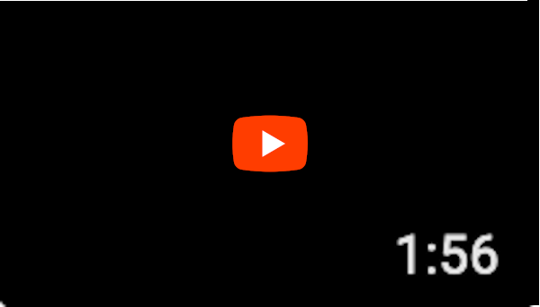

# Sperax Docs UI

<br/>

## Table of Contents 
**[Disclaimer](#disclaimer)** &nbsp; | &nbsp; **[Installation](#installation)** &nbsp;| &nbsp;**[Deployment](#deployment)** &nbsp;| &nbsp;**[Why Docusaurus?](#why-docusaurus)** &nbsp;| **[Animations](#animations)** &nbsp;| **[Video](#video)** &nbsp;|&nbsp; **[Design Process](#design-process)**

<br/>

## Installation 
1. Clone this repository
2. Run **`npm run install`** from the root directory to install all dependencies
3. Run **`npm run start`** to run on a local development server 
   (should auto start on port 3000)
4. Run **`npm run build`** to build the site into a directory of static contents
5. Run **`npm run generate-docs`** to generate `global.html` JSDoc in `jsdoc/`

<br/>

## Deployment

```
$ GIT_USER=<Your GitHub username> USE_SSH=true yarn deploy
```

If you are using GitHub pages for hosting, this command is a convenient way to build the website and push to the `gh-pages` branch. Check out the docs on [deployment](https://docusaurus.io/docs/deployment) for more details.

<br />

## Why Docusaurus?
   Docusaurus is a free, open source, React-based, MDX powered static site generator with all of the standard, recognizable features expected and desired from a documentation site. It was rolled out by Facebook to make developing, deploying, and maintaining documentation simple and straightforward. As easy as 1, 2, 3. 

  Docusaurus is used by "thousands of organizations to power their documentation websites", including **[many popular open source projects](https://v1.docusaurus.io/en/users)**. So even if you've never heard of Docusaurus, chances are, you have visited a website using Docusaurus. Support for Markdown syntax means that you can fire up your favorite text editor/IDE and quickly write up a developer doc in a lightweight markup language that you know and love 🤓. Perhaps it sounds like I am affiliated with FB/Docusaurus, but rest assured, I knew nothing about Docusaurus prior to this. I just happened to stumble upon **[Solana's Developer Docs](https://docs.solana.com/)** among several other developer documentation sites and noticed striking similarities. Lo and behold, they all use Docusaurus, including **[Uniswap Docs](https://docs.uniswap.org/)** - the referenced model inspiration site.

<br />

## Animations
### Twinkle Stars ✨
#### Default

#### Night Sky

#### Milky Way


### Snow Fall 
#### Normal style


### Snow Melt 
#### Curtain style


<br/>

#### Not enough stars? Your wish is my (code's) command.

Enjoy one with 2,000 stars:


Here's another 🌟 for good luck!

#### Sick of stars? Disable animation to get a banner with no twinkling stars 🙁


### More Screen Shots


<br />

## Video
<a href="https://rebrand.ly/sperax-docs-ui-demo" target="_blank"></a>

**Note**: If video link is broken, then that means I never got around to creating a video.

<br/>

## Design Process
What do stars and snow have to do with crypto finance, deFi, and blockchain? Well, stars and snow are one with nature ... nature is perceived as a source of truth ... and blockchain/smart contracts are supposedly a "definitive source of truth" (**[so I've heard](https://youtube.com/watch?v=EsVVhjv1FT4)**). Stars in a constellation are like nodes on a blockchain...

If all that sounds like a stretch, it's cause it is lol. I went with these themes just because. 😂

It's challenging to design for a brand knowing very little to nothing about it. Not just the brand, but also the customers/audience and the niche that the company operates in. I checked Sperax's website, but honestly, I don't get what Sperax is or does. Skimming over the text, I realized that most of the technical concepts presented were beyond my knowledge and understanding. So I just focused on the elements & layout on the webpage. I noticed that there isn't much of a defined color scheme. Some shades of green, blue, and purple stood out, so I stuck with those colors.

There really isn't much to the design. The Docusarus template is solid on its own, and everything that is needed is accessible in the public domain. No need to reinvent the wheel and aim to design/develop a template from scratch when a free, perfectly working, routinely tested, (did I say *free*?), out-of-the-box solution already exists. 

This is what confused me most about the challenge requirements. Unless Sperax requires a private, decentralized alternative (which now that I think about it, probably makes more sense 🤔), I believe Docusaurus on its own fits the bill quite nicely for Sperax USD Docs. What matters most about a code documentation site is the content, content flow, and functionality - less so the appearance and design. Replace the text, add some images, change the colors to align with the Sperax brand and, voilà, you have yourself a neat code documentation site. All this in just a matter of minutes 👍. Maybe throw in a user feedback poll at the bottom of each guide or doc to spice things up. This is my 2¢ 🙂.

<br/>

## Disclaimer

By accessing and accepting this project submission, you agree that you have read and understand the terms below. 

The core template (backbone) of this project is powered by a third party open source software provider (Facebook™), and is used, modified, and published with permission under the [MIT license](https://github.com/facebook/docusaurus/blob/main/LICENSE). JPG images in `static/img` are Unsplash photos, which are free to download, use, modify, and distribute under the [Unsplash license](https://unsplash.com/license). 
The name, "Sperax", along with the Sperax blockchain company logo (retrieved from the company's website) are used strictly in accordance with the guidelines, only within the context of the hackathon. 

This project was created with the sole purpose of submitting to the 'Sperax USD Docs Navigation UI' contest. Parts of this code were authored and refactored by a non-developer whose knowledge on web development and React.js is limited to a [React crash course video](https://youtube.com/watch?v=sBws8MSXN7A), an unhealthy amount of DuckDuckGo-ing, random online tutorials, and trial & error. This explains the difficult to decipher spaghetti code that is ~~potentially~~ likely riddled with bugs and inefficient algos. A list of known bugs are documented in `bugs.txt`. Any file containing code written by the author is marked with a red octagonal stop sign emoji 🛑 at the top as fair warning. Accept or use at your own risk and discretion. 

__

**TL;DR** &nbsp; Please don't come after me! ☮️🧘🏻‍♀️🙏


#### ✅ [I accept these terms](#table-of-contents)